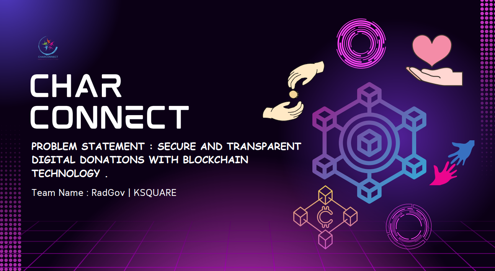
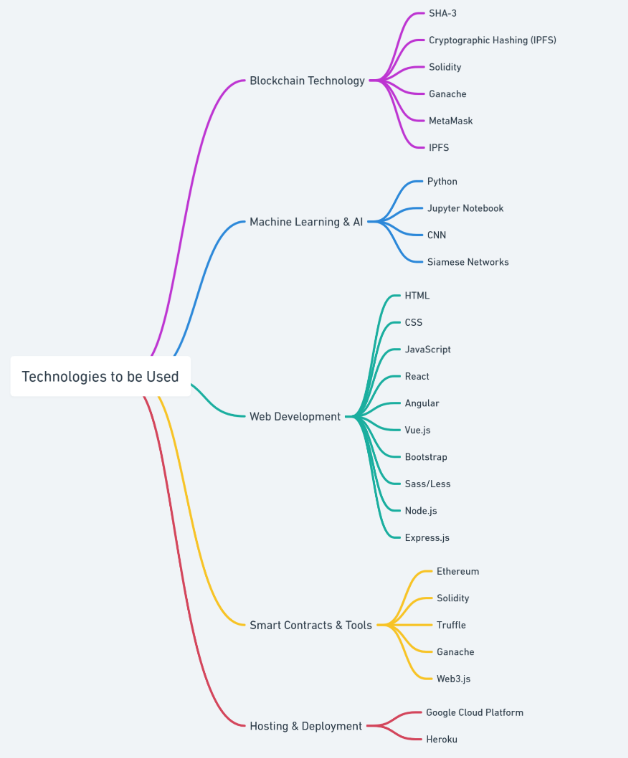
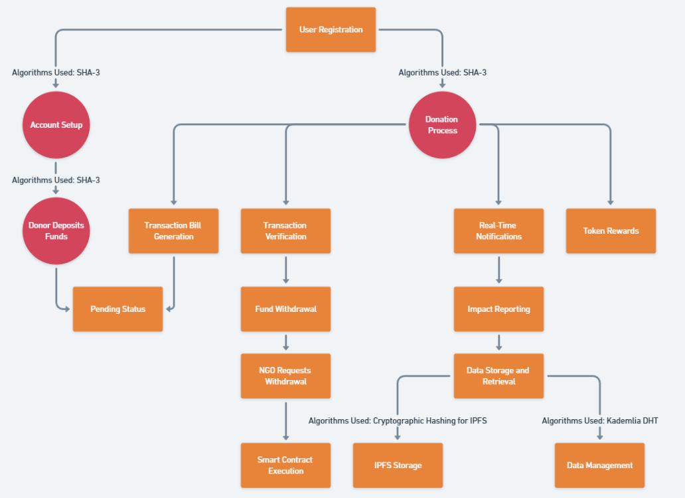
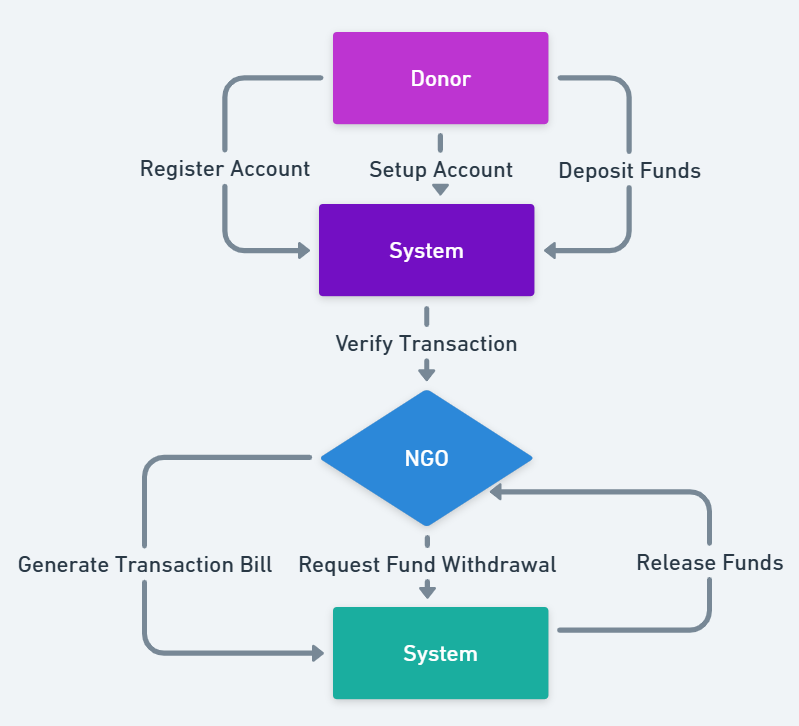
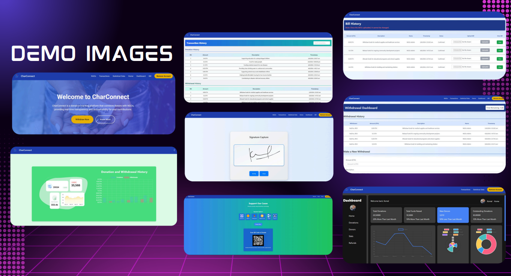

# 💖 CharConnect 

# 🌟 Secure and Transparent Digital Donations with Blockchain Technology 🌟




## 🚀 Problem Statement
Creating a secure and transparent platform for digital donations using blockchain technology.

### 🏦 Key Features
- **Joint Accounts**: Shared private key with individual passwords for enhanced security 🔒.
- **Transparent Transactions**: Clear, secure deposits and withdrawals 💸.
- **Blockchain Bills**: Auto-stored transactions pending verification for accountability 📜.
- **Signature Scanning**: ML-powered technology for enhanced security 🧠.
- **Real-Time Alerts**: Instant updates for donors and NGOs 🔔.
- **Smart Contracts**: Automatic fund release upon NGO milestones 🎯.
- **Universal Payment via QR Code**: Pay with any cryptocurrency by simply scanning a QR code. Powered by the Solidity , this feature allows seamless transactions using wallets like MetaMask or others, automatically recognizing your cryptocurrency choice 💳.
- **Generative AI Data Analysis**: The database, powered by Filecoin, uses generative AI techniques to analyze transactions, withdrawals, and user ratings. It provides insights through graphs, charts, and clustering, allowing users to query any transaction-related data. The model also predicts insights based on historical transaction data 📊.


## 💡 How Different Is This from Other Existing Ideas?
### Unique Selling Propositions (USP)
- **Joint Accounts**: Secure shared access with a private key 🔑.
- **Transparent Bills**: All transactions are stored on the blockchain for full visibility 🌐.
- **ML Scanning**: Enhanced security through machine learning 🛡️.
- **Donor Rewards**: Token system to reward donors for their contributions 🎁.
- **Impact Dashboard**: Tracks and displays donor impact over time 📊.
- **QR Code Payments**: Effortless cryptocurrency transactions with a simple QR scan, enhancing convenience for users 🔄.
- **AI-Driven Insights**: Generative AI analyzes user transactions and provides actionable insights, empowering users with data-driven decision-making 📈.
- **Gas Fee Optimization**: Leveraging Hive to minimize transaction costs, ensuring a smoother user experience 🔧.

## 🛠️ Methodology
This blockchain-based donation platform will utilize:

- **Cryptographic Algorithms**: Implementing state-of-the-art cryptographic methods for security, including SHA-3 for secure hashing 🔐.
- **Machine Learning Models**: Enhancing transaction security and user verification processes 🤖.
- **Decentralized Storage**: Ensuring data integrity and availability on a distributed network 🌍.

The platform initiates with joint accounts between donors and NGOs, secured using advanced cryptographic techniques to protect sensitive information. All transactions will remain secure and immutable on the blockchain, safeguarding against tampering and unauthorized access.




## 📊 Process and Flow

| Process Flow | Visualisation |
|------------------|-----------|
|  |  |




## 📚 Tech Stack
- **Blockchain**: Ethereum, Solidity
- **Frontend**: React.js
- **Backend**: Node.js, Express
- **Database**: MongoDB
- **Machine Learning**: Python, Scikit-learn
- **Deployment**: Docker, AWS

### 🛠️ Additional Setup
1. **Install MetaMask**: Add the MetaMask extension to your browser from [MetaMask](https://metamask.io/).
2. **Install Ganache**: Download Ganache from [Truffle Suite](https://www.trufflesuite.com/ganache) and install it to set up a local blockchain environment.
3. **Install Truffle**: If you haven't installed Truffle yet, you can do so globally with the following command:


## 📄 Getting Started
To get started with the project, clone this repository and install the necessary dependencies:

 ```bash
git clone https://github.com/komalpathak2004/CharConnect-KSQUARE.git
cd your-repo-name
npm install
npm install -g truffle
npm start 
 ```
 
## 🎥 Demo Video
Watch the demo video to see the entire CharConnect project in action: [Watch Demo Video](https://youtu.be/k9j4TYGbSC0?si=AvFzBl41cuedQ1vp)

<video width="600" controls>
  <source src="./public/NayaK Intro-2.mp4" type="video/mp4">
  Your browser does not support the video tag.
</video>

Explore how we're using blockchain technology to create a more transparent, secure, and efficient donation ecosystem. For more details, check out our PDF guide linked below. 📄👇

###  Pdf To CharConnect Idea and Methodology : https://drive.google.com/file/d/19knQS1vhvk4Igb2P0OlrU9zgTi7A-ajt/view?usp=sharing

### 🤝 Contributing
We welcome contributions! Please read our CONTRIBUTING.md for guidelines.

### 📬 Contact
For any inquiries, feel free to reach out:

### LinkedIn of Founders of CharConnect: 
Komal Pathak - https://www.linkedin.com/in/komal-pathak-073127289/

Kunal Nayak - https://www.linkedin.com/in/kunal-nayak-74b189301/ 


---

### Thank you for checking out our project! Together, we can make a difference in the world of digital donations! | Team RadGov| KSQUARE 🌍💖
